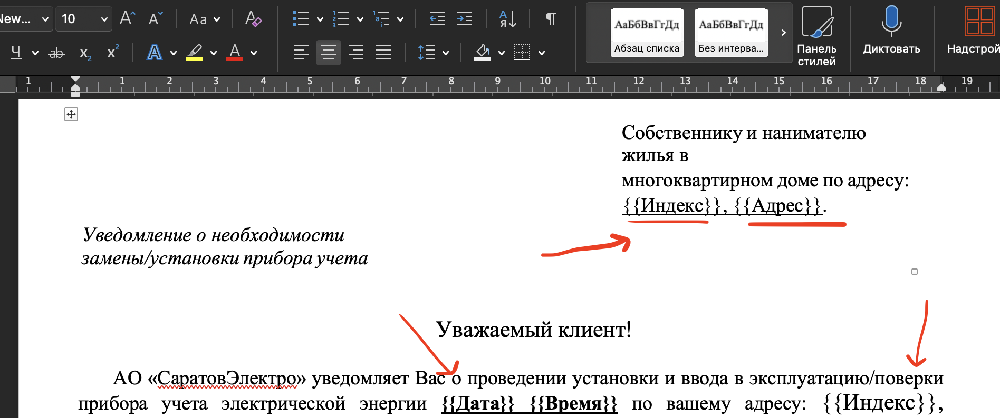
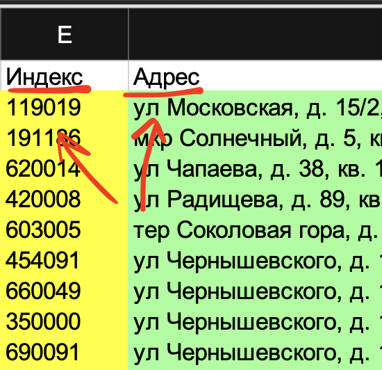

# SimpleDocGenerator
(sorry for spagetti)

# Использование


В шаблонах должны быть указаны названия полей СООТВЕТСТВУЮЩИЕ названиям полей из Excel файла
В формате: `{{Название}}` без пробелов






# Запуск

```bash
pip install -r requirements.txt
python main.py
```

# Компиляция

```bash
pip install -r requirements.txt
```
```bash
pyinstaller --noconfirm --onefile --windowed --icon "exe_belly/app_icon.ico" --add-data "exe_belly;exe_belly" --collect-all docxcompose --collect-all customtkinter --collect-all tkinterdnd2 --name "DocGenerator" main.py
```
или
```bash
pyinstaller DocGenerator.spec
```
